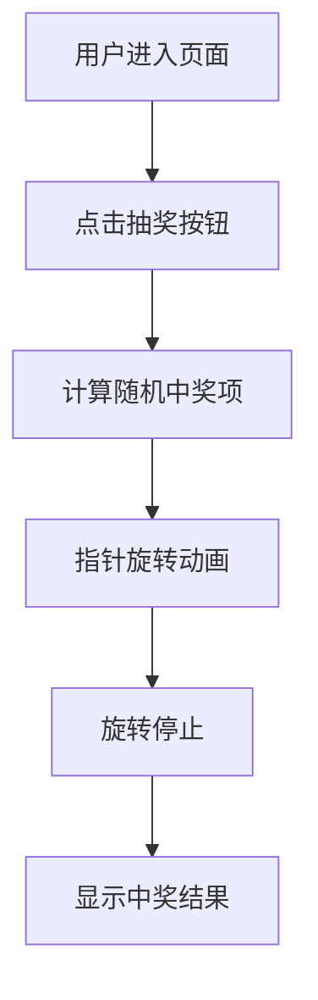

## 1. 产品概述
这是一个简单的网页抽奖大转盘，旨在让用户无需登录即可直接参与抽奖。用户可以通过微信等社交平台分享链接，朋友点击链接后即可进入页面进行抽奖。
- 解决问题：提供一个简单、有趣且易于分享的互动工具。
- 目标用户：需要快速创建互动活动的用户及其朋友。

## 2. 核心功能

### 2.1 奖项配置与概率
- **奖项列表**：麦当劳、肯德基、奶茶、火锅、烧烤、未中奖。
- **概率逻辑**：
  - “未中奖”概率为 0%。
  - 其余五项奖项概率均等（各 20%）。

### 2.2 功能模块
1. **抽奖页面**：包含大转盘、抽奖按钮、中奖结果显示。
2. **反转动画逻辑**：指针在即将停止时，先指向“未中奖”，最后瞬间跳跃至真实奖项。

### 2.3 页面详情
| 页面名称 | 模块名称 | 功能描述 |
|-----------|-------------|---------------------|
| 抽奖主页 | 大转盘模块 | 视觉化的转盘，奖项分布：麦当劳、肯德基、奶茶、火锅、烧烤、未中奖。 |
| 抽奖主页 | 抽奖控制区 | 指针采用“握拳伸食指”UI，保持竖直状态沿轨道旋转。 |
| 抽奖主页 | 动画欺骗 | 指针在终点前会有一个从“未中奖”到真实奖项的瞬间位移。 |

## 3. 核心流程
用户点击开始 -> 指针绕圆盘高速旋转 -> 指针减速并趋向“未中奖”区域 -> 在停稳前一刻瞬间移动到相邻的真实奖项 -> 弹出中奖提示。

## 4. 用户界面设计
### 4.1 设计风格
- **主色调**：粉色系（代表可爱、温馨）。
- **按钮样式**：粉色主题的 3D 圆形按钮，位于转盘中心。
- **指针设计**：使用可爱的猫爪图标作为指针，猫爪沿着转盘外圈（奖项文字上方一点）的轨道旋转。
- **字体**：圆润、现代的字体。
- **布局**：居中对齐，转盘占据页面主要位置，背景使用粉色渐变或轻微的纹理。

### 4.2 页面设计概览
| 页面名称 | 模块名称 | UI 元素 |
|-----------|-------------|-------------|
| 抽奖主页 | 大转盘 | 多彩扇形区域（调整为粉色系或柔和色彩），带边框阴影。 |
| 抽奖主页 | 指针轨道 | 猫爪指针在外圈轨道上保持竖直绕行。 |
| 抽奖主页 | 背景 | 动态粉色渐变背景，增加视觉吸引力。 |

### 4.3 响应式
- **移动端优先**：针对微信内置浏览器进行优化，适配各种手机屏幕尺寸。
- **触摸优化**：按钮大小适合手指点击，动画平滑不卡顿。
