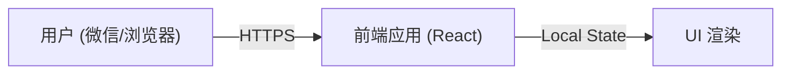

## 1. 架构设计

## 2. 技术描述
- 前端框架：React@18 + TailwindCSS@3 + Vite
- 动画实现：CSS Animations (针对手指指针的旋转)
- 状态管理：React Hooks (useState)
- 初始化工具：vite-init

## 3. 路由定义
| 路由 | 用途 |
|-------|---------|
| / | 抽奖主页 |

## 4. 部署建议
- **托管平台**：推荐使用 Vercel 或 Netlify，支持一键部署并提供免费的 HTTPS 链接。
- **分享方式**：部署后将生成的链接发送至微信即可访问。
